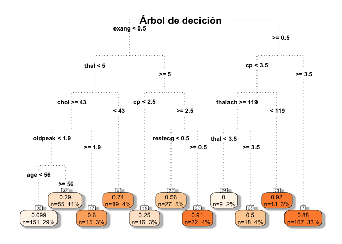

------------------------------------------------------------------------

ELECCIÓN JUEGO DE DATOS
=======================

------------------------------------------------------------------------

Solo en 2012, muerieron más de 17 millones de personas en el mundo por
enfermedades cardiovasculares, según datos oficiales de la Organización
Mundial de la Salud, convirtiéndose en una de las principales causa de
denfunción a nivel mundial. Las enfermedades cardiovasculares son un
conjunto del trastorno del corazón y los vasos sanguíneos.

El data set elegido ha sido “Heart Disease Data Set” obtenidos de
distintas fuentes: Cleveland Clinical Foundation, Instituto de
Cardiología de Hungria, V.A Centro Médico y la Universidad de Zurich. El
motivo por el que elegí este data set, o más concretamente, este campo
de estudio que son las enfermedades cardiovasculares, fue porque quería
comprobar cómo los avances que ofrece el análisis de datos pueden ser
primordiales a la hora de identificar de manera precoz la presencia de
enfermedades cardiovasculares en los pacientes. La ventaja de usar la
metodología que ofrece el aprendizaje automático es que puede manejar
una cantidad de datos ingente y obtenidos de un centenar de fuentes
diferentes, lo que nos deja con unos datos variodos a la par que
complejos, puesto que los resultados obtenidos de las distintas pruebas
o análisis médicos resultan difícil de ser analizados a grande escala.

El conjunto de datos Utilizado cuenta con las siguientes variables: 1.
(age) age: age in years 2. (sex) sex (1 = male; 0 = female) 3. (cp)
chest pain type – Value 1: typical angina – Value 2: atypical angina –
Value 3: non-anginal pain – Value 4: asymptomatic 4. (trestbps) resting
blood pressure (in mm Hg on admission to the hospital) 5. (chol) serum
cholestoral in mg/dl 6. (fbs) (fasting blood sugar &gt; 120 mg/dl) (1 =
true; 0 = false) 7. (restecg) resting electrocardiographic results –
Value 0: normal – Value 1: having ST-T wave abnormality (T wave
inversions and/or ST elevation or depression of &gt; 0.05 mV) – Value 2:
showing probable or definite left ventricular hypertrophy by Estes’
criteria 8. (thalach) maximum heart rate achieved 9. (exang) exercise
induced angina (1 = yes; 0 = no) 10. (oldpeak) ST depression induced by
exercise relative to rest 11. (slope) the slope of the peak exercise ST
segment – Value 1: upsloping – Value 2: flat – Value 3: downsloping 12.
(ca) number of major vessels (0-3) colored by flourosopy 13. (thal) 3 =
normal; 6 = fixed defect; 7 = reversable defect 14. (goal) (the
predicted attribute) diagnosis of heart disease (angiographic disease
status) – Value 0: &lt; 50% diameter narrowing – Value 1: &gt; 50%
diameter narrowing (in any major vessel: attributes 59 through 68 are
vessels)

Con este estudio, pretendo lograr un análisis preeliminar de cara a
realizar diferentes actividades con ellos en el futuro. En primera
instancia, cargaremos y transformaremos los datos. Luego haremos un
análisis exploratorio en el que identificaremos tendencias y anomalías.
Podremos analizar la correlación que hay entre los distintos síntomas
(las distintas variables) que nos permitirán determinar qué datos son
los más relevantes a la hora de determinar qué pacientes pueden o están
desarrollando una enfermedad cardiovascular. Nos centraremos sobre todo
en saber si hay alguna diferencia entre los síntomas o resultados de las
pruebas en las mujeres con respecto a los de los hombres.

------------------------------------------------------------------------

CARGA DE DATOS
==============

------------------------------------------------------------------------

    # cargamos los datos
    cleveland <- read.csv('https://archive.ics.uci.edu/ml/machine-learning-databases/heart-disease/processed.cleveland.data',na = "?",stringsAsFactors = FALSE, header = FALSE)
    hungarian <- read.csv('https://archive.ics.uci.edu/ml/machine-learning-databases/heart-disease/processed.hungarian.data',na = "?",stringsAsFactors = FALSE, header = FALSE)
    switzer <- read.csv('https://archive.ics.uci.edu/ml/machine-learning-databases/heart-disease/processed.switzerland.data',na = "?",stringsAsFactors = FALSE, header = FALSE)
    longbeach <- read.csv('https://archive.ics.uci.edu/ml/machine-learning-databases/heart-disease/processed.va.data',na = "?",stringsAsFactors = FALSE, header = FALSE)

    # guardamos los distintos archivos en un único data frame y cargamos los nombres
    heartData <- rbind(cleveland,hungarian,switzer,longbeach)
    names(heartData) <- c("age","sex","cp","trestbps","chol","fbs","restecg","thalach","exang","oldpeak","slope","ca","thal","goal")

    # Exportamos las datos 
    write.csv(heartData, "heartData_original.csv")

    # analizamos los datos que tenemos

    # sex: edad en años (continua)
    # sex: 1 = hombre, 0 = mujer (categórica)
    # cp: (chest pain) tipo de dolor de pecho: 1 = typical angina; 2 = atypical angina; 3 = non-anginal pain; 4 = asymptotic (categórica)
    # trestbps: (Resting Blood Pressure) presión arterial en reposo (in mm Hg a la hora de ser ingresado en el hospital) (continua)
    # chol: (Serum Cholestrol) colesterol en mg/dL (continua)
    # fbs: (Fasting Blood Sugar) compara el azúcar en sangre estando en ayunas > 120 mg/dl (1 = true, 0 = false) (categórica)
    # restecg: resultados del electrocardiograma en reposo: 0 = normal; 1 = havingST-T wave abnormality; 2 = left ventricular hyperthrophy (categórica)
    # thalach: (Max heart rate achieved) ritmo cardiaco (continua)
    # exang: (Exercise induced angina) angina (1 = yes; 0 = no) (categórica)
    # oldpeak: depresión del segmento ST inducida por el ejercicio relativo al reposo (continua)
    # slope: (Peak exercise ST segment) pendiente del máximo del ejercicio del segmento ST: 1 = upsloping; 2 = flat; 3 = downsloping (categórica)
    # ca: número mayor de vasos (continua)
    # thal: 3 = normal; 6 = fixed defect; 7 = reversable defect (categórica)
    # goal: si el individuo sufre enfermedad cardiovasclar o no: 0 = no; 1,2,3,4 = sí (categórica)

    str(heartData)

    ## 'data.frame':    920 obs. of  14 variables:
    ##  $ age     : num  63 67 67 37 41 56 62 57 63 53 ...
    ##  $ sex     : num  1 1 1 1 0 1 0 0 1 1 ...
    ##  $ cp      : num  1 4 4 3 2 2 4 4 4 4 ...
    ##  $ trestbps: num  145 160 120 130 130 120 140 120 130 140 ...
    ##  $ chol    : num  233 286 229 250 204 236 268 354 254 203 ...
    ##  $ fbs     : num  1 0 0 0 0 0 0 0 0 1 ...
    ##  $ restecg : num  2 2 2 0 2 0 2 0 2 2 ...
    ##  $ thalach : num  150 108 129 187 172 178 160 163 147 155 ...
    ##  $ exang   : num  0 1 1 0 0 0 0 1 0 1 ...
    ##  $ oldpeak : num  2.3 1.5 2.6 3.5 1.4 0.8 3.6 0.6 1.4 3.1 ...
    ##  $ slope   : num  3 2 2 3 1 1 3 1 2 3 ...
    ##  $ ca      : num  0 3 2 0 0 0 2 0 1 0 ...
    ##  $ thal    : num  6 3 7 3 3 3 3 3 7 7 ...
    ##  $ goal    : int  0 2 1 0 0 0 3 0 2 1 ...

    summary(heartData)

    ##       age             sex               cp          trestbps    
    ##  Min.   :28.00   Min.   :0.0000   Min.   :1.00   Min.   :  0.0  
    ##  1st Qu.:47.00   1st Qu.:1.0000   1st Qu.:3.00   1st Qu.:120.0  
    ##  Median :54.00   Median :1.0000   Median :4.00   Median :130.0  
    ##  Mean   :53.51   Mean   :0.7891   Mean   :3.25   Mean   :132.1  
    ##  3rd Qu.:60.00   3rd Qu.:1.0000   3rd Qu.:4.00   3rd Qu.:140.0  
    ##  Max.   :77.00   Max.   :1.0000   Max.   :4.00   Max.   :200.0  
    ##                                                  NA's   :59     
    ##       chol            fbs            restecg          thalach     
    ##  Min.   :  0.0   Min.   :0.0000   Min.   :0.0000   Min.   : 60.0  
    ##  1st Qu.:175.0   1st Qu.:0.0000   1st Qu.:0.0000   1st Qu.:120.0  
    ##  Median :223.0   Median :0.0000   Median :0.0000   Median :140.0  
    ##  Mean   :199.1   Mean   :0.1663   Mean   :0.6046   Mean   :137.5  
    ##  3rd Qu.:268.0   3rd Qu.:0.0000   3rd Qu.:1.0000   3rd Qu.:157.0  
    ##  Max.   :603.0   Max.   :1.0000   Max.   :2.0000   Max.   :202.0  
    ##  NA's   :30      NA's   :90       NA's   :2        NA's   :55     
    ##      exang           oldpeak            slope             ca        
    ##  Min.   :0.0000   Min.   :-2.6000   Min.   :1.000   Min.   :0.0000  
    ##  1st Qu.:0.0000   1st Qu.: 0.0000   1st Qu.:1.000   1st Qu.:0.0000  
    ##  Median :0.0000   Median : 0.5000   Median :2.000   Median :0.0000  
    ##  Mean   :0.3896   Mean   : 0.8788   Mean   :1.771   Mean   :0.6764  
    ##  3rd Qu.:1.0000   3rd Qu.: 1.5000   3rd Qu.:2.000   3rd Qu.:1.0000  
    ##  Max.   :1.0000   Max.   : 6.2000   Max.   :3.000   Max.   :3.0000  
    ##  NA's   :55       NA's   :62        NA's   :309     NA's   :611     
    ##       thal            goal       
    ##  Min.   :3.000   Min.   :0.0000  
    ##  1st Qu.:3.000   1st Qu.:0.0000  
    ##  Median :6.000   Median :1.0000  
    ##  Mean   :5.088   Mean   :0.9957  
    ##  3rd Qu.:7.000   3rd Qu.:2.0000  
    ##  Max.   :7.000   Max.   :4.0000  
    ##  NA's   :486

    sapply(heartData, class)

    ##       age       sex        cp  trestbps      chol       fbs   restecg   thalach 
    ## "numeric" "numeric" "numeric" "numeric" "numeric" "numeric" "numeric" "numeric" 
    ##     exang   oldpeak     slope        ca      thal      goal 
    ## "numeric" "numeric" "numeric" "numeric" "numeric" "integer"

------------------------------------------------------------------------

LIMPIEZA Y TRANSFORMACIÓN DE DATOS
==================================

------------------------------------------------------------------------

Vamos a limpiar y transformar los datos. La verdad es que los datos que
hemos descargado ya están bastante procesados: solo contamos con las 14
columnas que se consideran relevantes según los autores del data set en
vez de las 75 originales, las variables que estaban como texto (sex, por
ejmplo) ya cuentan con valores numéricos. Por lo que sobre todo
trataremos los valores nulos del data set además de modificar los
valores de una variable.

    # comprobamos si hay nulos
    # hay que tener en cuenta que a la hora de cargar los datos, hemos indicado que lea como valores nulos allí donde aparezca "?"
    colSums(is.na(heartData)) 

    ##      age      sex       cp trestbps     chol      fbs  restecg  thalach 
    ##        0        0        0       59       30       90        2       55 
    ##    exang  oldpeak    slope       ca     thal     goal 
    ##       55       62      309      611      486        0

    # comprobamos cuántos objetos no tienen ningún nulo
    heartCompleto <- heartData[complete.cases(heartData), ]

    # eliminamos la variable ca
    heartData <- heartData[,-12]

    # eliminamos las filas que tienen valores nulos en trestbps, thalach, exang y oldpeak
    heartData <- heartData[!is.na(heartData$trestbps),]
    heartData <- heartData[!is.na(heartData$thalach),]
    heartData <- heartData[!is.na(heartData$exang),]
    heartData <- heartData[!is.na(heartData$oldpeak),]

    # eliminamos restecg, chol y fbs
    heartData <- heartData[!is.na(heartData$restecg),]
    heartData <- heartData[!is.na(heartData$chol),]
    heartData <- heartData[!is.na(heartData$fbs),]

    # damos un valor a los nulos
    heartData$slope[is.na(heartData$slope)] <- 4 # 4 =  categoría para valores desconocidos
    heartData$thal[is.na(heartData$thal)] <- 4

    # reordenamos las filas
    row.names(heartData) <- 1:nrow(heartData)

    # los valores 2, 3 y 4 de la columa goal, pasarán a ser 1: enfermo
    heartData$goal[heartData$goal == 2] <- 1
    heartData$goal[heartData$goal == 3] <- 1
    heartData$goal[heartData$goal == 4] <- 1

Lo primero que hemos hecho ha sido limpiar los valores nulos. Tenemos un
total de 920 observaciones y 1.759 valores nulos de un total de 12.880
valores. Cuando observamos cuántos nulos hay por variable, vemos que hay
tres variables que destacan bastante sobre el resto: - slope: 309 nulos;
esto supone un 33% de valores nulos. - ca: 611 nulos; esto supone un 66%
de valores nulos. - thal: 486 nulos; esto supone un 52% de valores
nulos.

Comprobamos cuántos objetos tienen todos los valores y vemos que solo
hay 299, por lo que optar por quitar todos los nulos nos quedaría con
pocos observaciones para realizar el estudios. Optamos entonces por
otras alternativas. Como la variable ca tiene un 66% de sus valores
nulos, la eliminamos del data frame, puesto que no la consideramos
determinante para los resultados del estudio.

Vemos que trestbps, thalach, exang y oldpeak tienengit sat valores
aparecen como nulos práctimaente en las mismas observaciones. Así pues,
también hemos optado por eliminar estos valores nulos. Estos datos
representan el 8% de los datos. Después de investigar un poco, pudimos
ver que estas variables hacen referencia a los parámetros que se
analizan en una prueba de esfuerzo específica que se hace a los
pacientes en estas situaciones (Exercise stress test, Harvard Health
Publishing 2010) por lo que podemos deducir que estos pacientes no
fueron sometidos a estos test.

La variable restcg solo cuanta con dos nulos, por lo que podemos
eliminarlos también.

Puesto que fbs es una variable boleana, vamos a eliminar los nulos que
contenga.

También eliminamos la vairable chol.

Para slope y thal, que suponían un 33% y un 52% respectivamente. Estos
datos ya han sido procesados, incialmente, estos dos variables eran
categóricas, teniendo los siguiente valores: - slope: downsloping, flat
y upsloping - thal: fixed effect, normal, reversible defect Pues que
estas variables ya están factorizadas en estos datos, vamos a tomar los
nulos como si fueran datos desconocidos y les vamos a identificar con 4,
como si fuera una categoría más.

Finalmente, en la variable goal, la que determina si el paciente va a
tener o no enfermedad cardíaca, vemos que hay cuatro valores, que
indican el grado de enfermedad. Nosotros, realmente, lo que queremos es
un valor boleano que nos indique si lo está o no, ignorando el grado. Es
por eso que los valores 2, 3 y 4 pasarán a ser 1. Se queda entonces que
1 determina aquellos pacientes que sufren una enfermedad cardíaca
mientras que 0 determina aquellos que no.

Finalmente, nos quedamos con 740 obervaciones y 13 columnas. Los datos
se han reducido en un 20%.

Ahora aplicaremos algunas trasnformaciones adicionales pero necesarias a
los datos.

Reemplazamos las variables categoricas por su significado.

    # Preservamos el dataset sin transformar para anlisis posteriores que requieran variables numericas.

    heartData_num <- heartData

    # Realizamos la transformacion

    heartData$cp <- replace(heartData$cp, heartData$cp =="1", "typical angina")
    heartData$cp <- replace(heartData$cp, heartData$cp =="2", "atypical angina")
    heartData$cp <- replace(heartData$cp, heartData$cp =="3", "non — anginal pain")
    heartData$cp <- replace(heartData$cp, heartData$cp =="4", "asymptotic")
    heartData$cp <- as.factor(heartData$cp)
    unique(heartData$cp)

    ## [1] typical angina     asymptotic         non — anginal pain atypical angina   
    ## Levels: asymptotic atypical angina non — anginal pain typical angina

    heartData$fbs <- replace(heartData$fbs, heartData$fbs =="1", "true")
    heartData$fbs <- replace(heartData$fbs, heartData$fbs =="0", "false")
    heartData$fbs <- as.factor(heartData$fbs)
    unique(heartData$fbs)

    ## [1] true  false
    ## Levels: false true

    heartData$restecg <- replace(heartData$restecg, heartData$restecg =="0", "normal")
    heartData$restecg <- replace(heartData$restecg, heartData$restecg =="1", " having ST-T wave abnormality")
    heartData$restecg <- replace(heartData$restecg, heartData$restecg =="2", "eft ventricular hyperthrophy")
    heartData$restecg <- as.factor(heartData$restecg)
    unique(heartData$restecg)

    ## [1] eft ventricular hyperthrophy  normal                       
    ## [3]  having ST-T wave abnormality
    ## 3 Levels:  having ST-T wave abnormality ... normal

    heartData$exang <- replace(heartData$exang, heartData$exang =="1", "Yes")
    heartData$exang <- replace(heartData$exang, heartData$exang =="0", "No")
    heartData$exang <- as.factor(heartData$exang)
    unique(heartData$exang)

    ## [1] No  Yes
    ## Levels: No Yes

    heartData$slope <- replace(heartData$slope, heartData$slope =="1", "upsloping")
    heartData$slope <- replace(heartData$slope, heartData$slope =="2", "flat")
    heartData$slope <- replace(heartData$slope, heartData$slope =="3", "downsloping")
    heartData$slope <- as.factor(heartData$slope)
    unique(heartData$slope)

    ## [1] downsloping flat        upsloping   4          
    ## Levels: 4 downsloping flat upsloping

    heartData$thal <- replace(heartData$thal, heartData$thal =="3", "normal")
    heartData$thal <- replace(heartData$thal, heartData$thal =="6", "fixed defect")
    heartData$thal <- replace(heartData$thal, heartData$thal =="7", "reversible defect")
    heartData$thal <- as.factor(heartData$thal)
    unique(heartData$thal)

    ## [1] fixed defect      normal            reversible defect 4                
    ## Levels: 4 fixed defect normal reversible defect

    heartData$goal <- replace(heartData$goal, heartData$goal =="0", "Ausencia")
    heartData$goal <- replace(heartData$goal, heartData$goal =="1", "Presencia")
    heartData$goal <- as.factor(heartData$goal)
    unique(heartData$goal)

    ## [1] Ausencia  Presencia
    ## Levels: Ausencia Presencia

    heartData$sex <- replace(heartData$sex, heartData$sex =="0", "Male")
    heartData$sex <- replace(heartData$sex, heartData$sex =="1", "Female")
    heartData$sex <- as.factor(heartData$sex)
    unique(heartData$sex)

    ## [1] Female Male  
    ## Levels: Female Male

    # Fuente de las categorias https://towardsdatascience.com/heart-disease-prediction-73468d630cfc

Ahora nuetro dataset es mas comprensible y las columnas tienen el tipo
correcto, factor o double, segun corresponde.

    library(tidyverse) 

    ## Warning: package 'tidyverse' was built under R version 4.0.2

    ## ── Attaching packages ─────────────────────────────────────── tidyverse 1.3.0 ──

    ## ✓ ggplot2 3.3.2     ✓ purrr   0.3.4
    ## ✓ tibble  3.0.4     ✓ dplyr   1.0.2
    ## ✓ tidyr   1.1.2     ✓ stringr 1.4.0
    ## ✓ readr   1.4.0     ✓ forcats 0.5.0

    ## Warning: package 'ggplot2' was built under R version 4.0.2

    ## Warning: package 'tibble' was built under R version 4.0.2

    ## Warning: package 'tidyr' was built under R version 4.0.2

    ## Warning: package 'readr' was built under R version 4.0.2

    ## Warning: package 'purrr' was built under R version 4.0.2

    ## Warning: package 'dplyr' was built under R version 4.0.2

    ## Warning: package 'stringr' was built under R version 4.0.2

    ## Warning: package 'forcats' was built under R version 4.0.2

    ## ── Conflicts ────────────────────────────────────────── tidyverse_conflicts() ──
    ## x dplyr::filter() masks stats::filter()
    ## x dplyr::lag()    masks stats::lag()

    glimpse(heartData)

    ## Rows: 740
    ## Columns: 13
    ## $ age      <dbl> 63, 67, 67, 37, 41, 56, 62, 57, 63, 53, 57, 56, 56, 44, 52, …
    ## $ sex      <fct> Female, Female, Female, Female, Male, Female, Male, Male, Fe…
    ## $ cp       <fct> typical angina, asymptotic, asymptotic, non — anginal pain, …
    ## $ trestbps <dbl> 145, 160, 120, 130, 130, 120, 140, 120, 130, 140, 140, 140, …
    ## $ chol     <dbl> 233, 286, 229, 250, 204, 236, 268, 354, 254, 203, 192, 294, …
    ## $ fbs      <fct> true, false, false, false, false, false, false, false, false…
    ## $ restecg  <fct> eft ventricular hyperthrophy, eft ventricular hyperthrophy, …
    ## $ thalach  <dbl> 150, 108, 129, 187, 172, 178, 160, 163, 147, 155, 148, 153, …
    ## $ exang    <fct> No, Yes, Yes, No, No, No, No, Yes, No, Yes, No, No, Yes, No,…
    ## $ oldpeak  <dbl> 2.3, 1.5, 2.6, 3.5, 1.4, 0.8, 3.6, 0.6, 1.4, 3.1, 0.4, 1.3, …
    ## $ slope    <fct> downsloping, flat, flat, downsloping, upsloping, upsloping, …
    ## $ thal     <fct> fixed defect, normal, reversible defect, normal, normal, nor…
    ## $ goal     <fct> Ausencia, Presencia, Presencia, Ausencia, Ausencia, Ausencia…

------------------------------------------------------------------------

EXPLORACIÓN DE LOS DATOS
========================

------------------------------------------------------------------------

Valores atípicos
----------------

Vamos a tratar ahora los valores atípicos del data set. Para ello,
realizaremos diferentes diagramas de cajas y bigotes para localizar
dichos valores en las variables numéricas.

    require(reshape2)

    ## Loading required package: reshape2

    ## Warning: package 'reshape2' was built under R version 4.0.2

    ## 
    ## Attaching package: 'reshape2'

    ## The following object is masked from 'package:tidyr':
    ## 
    ##     smiths

    require(ggplot2)
    # dejamos de lado el resto de variables, ya que se tratan de variables categóricas y nos centramos en las numéricas
    meltedData <- melt(heartData[-c(2,3,6,7,9,11:13)])

    ## No id variables; using all as measure variables

    # mostramos los distintos diagramas en un solo plot
    p <- ggplot(data = meltedData, aes(x=variable, y=value, fill=variable)) + 
                 geom_boxplot()+
                 theme_minimal()
    p + facet_grid( ~ variable, scales="free")

Al analizar el resultado, vemos que no nos encontramos con muchos
valores atípicos en ninguna variable a excepción de chol y, en menos
medida, trestbps. En este caso, no vamos a tratar estos valores ni
imputándolos ni borrándolos de juego de datos, vamos a dejarlos tal
cual. Esta decisión se debe a que los valores, aunque atípicos dentro de
este juego de datos, no lo son a la hora de analizar las enfermedades
cardiovasculares. Es decir, es posible encontrar un paciente que tenga
&gt; 400 de colesterol. Quitar estos valores, podría generar una pérdida
importante de la información de cara al estudio de estas enfermedades.

Vamos a extraer este juego de datos a csv:

    write.csv(heartData, "heartData_clean.csv")

Ahora que dispoemos de datos limpios con los que trabajar nos disponemos
a extraer información relevante sobre el comportamiento de las
variables.

    require(dplyr)

    summarise(heartData)

    ## data frame with 0 columns and 1 row

    heartData %>%
        group_by(goal) %>%
        summarise(Count = n(),
                age_mean = round(x = mean(age), 2),
                trestbps_mean = round(x = mean(trestbps), 2),
                chol_mean = round(x = mean(chol), 2),
                thalach_mean = round(x = mean(thalach), 2),
                oldpeak_mean = round(x = mean(oldpeak), 2),
                ) %>% t()

    ## `summarise()` ungrouping output (override with `.groups` argument)

    ##               [,1]       [,2]       
    ## goal          "Ausencia" "Presencia"
    ## Count         "357"      "383"      
    ## age_mean      "50.3"     "55.7"     
    ## trestbps_mean "129.87"   "135.44"   
    ## chol_mean     "233.34"   "207.83"   
    ## thalach_mean  "149.29"   "128.91"   
    ## oldpeak_mean  "0.43"     "1.33"

En la tabla de medias tomamos en consideracion todas las variables
continuas que disponemos para explorar hacia que grupo de goal se
decantan.

En primer lugar, podemos notar que la muestra se encuentra dividida con
bastante equidad entre las personas que presentan enfermedad y las que
no.

La edad que a priori pensamos que seria una variable clave no muestra
especial inclinacion hacia un grupo u otro.

Son oldpea, thalach y chol las vriables que sí parecían mostrar
diferencias entre un grupo y otro.

    heartData %>%
      ggplot(aes(as.factor(goal), age ,fill = as.factor(goal))) +
        scale_x_discrete("Enfermedad")+
        scale_fill_manual(name = "Enfermedad", labels = c("Ausencia", "Presencia"),values = c("steelblue1", "darkorange1"))+
        geom_boxplot(alpha = 0.65)

Para comprobar las sospechas que tenemos sobre que no tenemos
diferencias en la edad creamos un boxplot donde corroboramos que
efectivamente esa diferencia no es asentuada, solo una pequeña tendencia
a la alza en el grupo que presenta enfermedades cardiacas.

    heartData  %>%
      ggplot(aes(x = as.factor(goal), fill = sex, color = sex)) + geom_bar(show.legend = T) +
      facet_wrap(~sex) +
      theme_minimal() + 
      ylab("Frecuencia") +
      xlab("")

Otro insight interesante que podemos obtener a partir del analisis
preliminar de los datos es que en la muestra las mujeres parecen tener
una diferencia significativa en cuanto a la presencia de enfermedades
cardiacas en comparacion a los hombres. Es importante mencionar tambien
que para este estudio se tienen menos observaciones de mujeres que de
hombres.

------------------------------------------------------------------------

ANÁLISIS DE LOS DATOS
=====================

------------------------------------------------------------------------

Análisi de la normalidad y homogeneidad de la varianza
======================================================

    require(gridExtra)

    ## Loading required package: gridExtra

    ## Warning: package 'gridExtra' was built under R version 4.0.2

    ## 
    ## Attaching package: 'gridExtra'

    ## The following object is masked from 'package:dplyr':
    ## 
    ##     combine

    p1 <- ggplot(data=heartData_num, aes(x=age)) +
        geom_density(color="grey33", fill="dodgerblue", alpha=0.4)

    p2 <- ggplot(data=heartData_num, aes(x=trestbps)) +
        geom_density(color="grey33", fill="pink1", alpha=0.4)

    p3 <- ggplot(data=heartData_num, aes(x=chol)) +
        geom_density(color="grey33", fill="seagreen", alpha=0.4)

    p4 <- ggplot(data=heartData_num, aes(x=thalach)) +
        geom_density(color="grey33", fill="red", alpha=0.4)

    p5 <- ggplot(data=heartData_num, aes(x=oldpeak)) +
        geom_density(color="grey33", fill="yellow", alpha=0.4)

    grid.arrange(p1, p2, p3, p4, p5)

    require(ggpubr)

    ## Loading required package: ggpubr

    ## Warning: package 'ggpubr' was built under R version 4.0.2

    require(gridExtra)

    p6 <-  ggqqplot(heartData_num$age)
    p7 <-  ggqqplot(heartData_num$trestbps)
    p8 <-  ggqqplot(heartData_num$chol)
    p9 <-  ggqqplot(heartData_num$thalach)
    p10 <- ggqqplot(heartData_num$oldpeak)

    grid.arrange(p6, p7, p8, p9, p10)

Como podemos ver por el análisi visual que nos ofrecen los gráficos de
densisdad y los gráficos Q-Q, todas las variables numéricas siguen una
distribución normal. Si bien se aprecian valores que se desvían, esto no
es suficiente para descartar la hipótesis de normalidad.

Para comprobar la homegenidad de las variables, vamos a realizar un
análisis anova.

    modelAnova <- aov(goal ~ oldpeak * thalach , data = heartData_num)
    summary(modelAnova)

    ##                  Df Sum Sq Mean Sq F value Pr(>F)    
    ## oldpeak           1  32.11   32.11 177.336 <2e-16 ***
    ## thalach           1  19.37   19.37 106.994 <2e-16 ***
    ## oldpeak:thalach   1   0.01    0.01   0.066  0.798    
    ## Residuals       736 133.27    0.18                   
    ## ---
    ## Signif. codes:  0 '***' 0.001 '**' 0.01 '*' 0.05 '.' 0.1 ' ' 1

En este caso se comprueba la homegeniedad de las vrianzas de las
varibales del modelo.

Aplicación de pruebas estadísticas y métodos de análisis estadísticos
=====================================================================

Vamos a realizar tres métodos de análisis estadísticos. En primer lugar,
vamos a realizar una matriz de correlación que nos permitirá ver la
relación que guardan las variables entre sí. Luego, realizaremos un
modelo de regresión lineal que nos permitirá poder predecir si los
pacientes desarrollarán o no una enfermedad cardiovascular. y
comprobaremos su eficiencia. En tercer lugar, pondremos en práctica un
árbol de decisión. Este nos permitirá ver qué variables son las más
representatativas a la hora de determinar la presencia de una enfermedad
en el paciente. Finalmente, haremos un K-means.

Correlación
-----------

Vamos a usar tres funciones diferentes: - rcorr: nos devolverá una lista
con los siguentes elementos: - r: la matriz de correlación - n: una
matriz que nos muestra el número de observaciones usadas para analizar
cada par de variables - p: los p-valores correspondientes al los niveles
de significación de correlación

corrplot: nos va a permitir visualizar gráficamente la matriz de
correlaciones: las correlaciones positivas aparecen representadas en
azul y las correlaciones negativas en rojo; las insignificantes aparecen
en blanco. La intensidad del color y el tamaño del círculo son
proporcionales a los coeficientes de correlación.

    require(corrplot)

    ## Loading required package: corrplot

    ## Warning: package 'corrplot' was built under R version 4.0.2

    ## corrplot 0.84 loaded

    # usamos la función corrplot para la visualización de la matriz de relaciones
    # antes necesitamos tener nuestro data ser como una matriz de correlaciones, usamos la función cor
    heartData_cor = cor(heartData_num,method = c("spearman"))
    corrplot(heartData_cor, type = "upper", order = "hclust", tl.col = "black", tl.srt = 60)

Podemos observar que no hay mucha correlación entre las variables.
Thalach tiende a mostrar una correlación negativa con el resto de
variables. La mayor correlación la encontramos entre goal y cp, goal y
exang y goal y oldpeak.

Regresión lineal
----------------

Vamos a realizar un modelo de regresión lineal que nos permitirá
predecir si un paciente tendrá o no una enfermedad cardiovascular. Para
realizar dicho modelo, usaremos las variables que más correlación
guardan entre ellas.

    attach(heartData)

    modelLineal <- lm(goal~age+sex+cp+oldpeak+exang+thalach,data = heartData_num,family = binomial)

    ## Warning: In lm.fit(x, y, offset = offset, singular.ok = singular.ok, ...) :
    ##  extra argument 'family' will be disregarded

    summary(modelLineal)

    ## 
    ## Call:
    ## lm(formula = goal ~ age + sex + cp + oldpeak + exang + thalach, 
    ##     data = heartData_num, family = binomial)
    ## 
    ## Residuals:
    ##      Min       1Q   Median       3Q      Max 
    ## -1.06094 -0.25941  0.00051  0.24860  1.07022 
    ## 
    ## Coefficients:
    ##               Estimate Std. Error t value Pr(>|t|)    
    ## (Intercept) -0.0997940  0.1606137  -0.621  0.53458    
    ## age          0.0046336  0.0016399   2.825  0.00485 ** 
    ## sex          0.2119347  0.0339390   6.245 7.19e-10 ***
    ## cp           0.1238637  0.0171699   7.214 1.36e-12 ***
    ## oldpeak      0.0979144  0.0144213   6.790 2.32e-11 ***
    ## exang        0.1985687  0.0352842   5.628 2.60e-08 ***
    ## thalach     -0.0025765  0.0006371  -4.044 5.81e-05 ***
    ## ---
    ## Signif. codes:  0 '***' 0.001 '**' 0.01 '*' 0.05 '.' 0.1 ' ' 1
    ## 
    ## Residual standard error: 0.3812 on 733 degrees of freedom
    ## Multiple R-squared:  0.4236, Adjusted R-squared:  0.4189 
    ## F-statistic: 89.79 on 6 and 733 DF,  p-value: < 2.2e-16

Comprobamos la eficiencia del modelo.

    predicciones <- ifelse(test = modelLineal$fitted.values > 0.5, yes = "Yes", no = "No")
    matriz_confusion <- table(modelLineal$model$goal , predicciones,
                              dnn = c("observaciones", "predicciones"))
    matriz_confusion

    ##              predicciones
    ## observaciones  No Yes
    ##             0 290  67
    ##             1  77 306

En el 0: el modelo acierta 290 de 357 En el 1: el modelo acierta 306 de
383

Un acierto del 80 %.

Ahora, podríamos usar este modelo para predecir si el paciente tendrá o
no una enfermedad cardiovascular:

    #▲ creamos un nuevo data frame con las caracterísitcas de un paciente imaginario
    newdata <- data.frame(
        age = 61,
        sex = 1,
        cp = 2,
        oldpeak = 3.5,
        exang = 1,
        thalach = 147)

    # Predecir si tendrá una enfermedad o no
    predict(modelLineal, newdata)

    ##         1 
    ## 0.8050388

Según nuestro modelo, la probabilidad de que el paciente caiga enfermo
es del 80,50 %.

Árbol de decisión
=================

Para crear el árbol de decisión, primero tenemos que separar lo datos en
train y test, con una proporción 70:30.

    require(caTools)

    ## Loading required package: caTools

    ## Warning: package 'caTools' was built under R version 4.0.2

    # vamos a poner la seed
    set.seed(120)
    # usamos la función sample.split para separar los valores. El SplitRatio nos permite separar los valores en 70-30.
    sampleValue = sample.split(heartData_num,SplitRatio=0.7) 
    heartTrain = subset(heartData_num, sampleValue == TRUE)
    heartTest = subset(heartData_num, sampleValue == FALSE)

    as.data.frame(table(heartTrain$goal))

    ##   Var1 Freq
    ## 1    0  251
    ## 2    1  261

    as.data.frame(table(heartTest$goal))

    ##   Var1 Freq
    ## 1    0  106
    ## 2    1  122

Comprobamos que los datos están bien distribuídos: Hay un total de 740
observaciones: 0 → 357 observaciones (48,25 %) 1 → 383 observaciones
(51,75 %)

En la variable heartTrain tenemos 512 observaciones, lo que suponene
69,18 % de los datos: 0 → 251 observaciones (49,02 %) 1 → 261
observaciones (50,98 %)

En la variable heartTest tenemos 228 observaciones, lo que suponene
30,82 % de los datos: 0 → 106 observaciones (46,50 %) 1 → 122
observaciones (53,50 %)

Los datos están, por lo tanto, bien divididos. Podemos pasar a crear el
modelo:

    require(rpart)

    ## Loading required package: rpart

    require(rpart.plot)

    ## Loading required package: rpart.plot

    ## Warning: package 'rpart.plot' was built under R version 4.0.2

    modelR <- rpart(formula = goal ~ ., data = heartTrain)
    rpart.rules(modelR, style = "tallw", cover = TRUE)

    ## goal is 0.000 with cover 2% when
    ##               exang is 1
    ##               thal < 4
    ##               cp < 4
    ##               thalach >= 119
    ## 
    ## goal is 0.099 with cover 29% when
    ##               exang is 0
    ##               thal < 5
    ##               chol >= 43
    ##               oldpeak < 1.9
    ##               age < 56
    ## 
    ## goal is 0.250 with cover 3% when
    ##               exang is 0
    ##               thal >= 5
    ##               cp < 3
    ## 
    ## goal is 0.291 with cover 11% when
    ##               exang is 0
    ##               thal < 5
    ##               chol >= 43
    ##               oldpeak < 1.9
    ##               age >= 56
    ## 
    ## goal is 0.500 with cover 4% when
    ##               exang is 1
    ##               thal >= 4
    ##               cp < 4
    ##               thalach >= 119
    ## 
    ## goal is 0.556 with cover 5% when
    ##               exang is 0
    ##               thal >= 5
    ##               cp >= 3
    ##               restecg < 1
    ## 
    ## goal is 0.600 with cover 3% when
    ##               exang is 0
    ##               thal < 5
    ##               chol >= 43
    ##               oldpeak >= 1.9
    ## 
    ## goal is 0.737 with cover 4% when
    ##               exang is 0
    ##               thal < 5
    ##               chol < 43
    ## 
    ## goal is 0.880 with cover 33% when
    ##               exang is 1
    ##               cp >= 4
    ## 
    ## goal is 0.909 with cover 4% when
    ##               exang is 0
    ##               thal >= 5
    ##               cp >= 3
    ##               restecg >= 1
    ## 
    ## goal is 0.923 with cover 3% when
    ##               exang is 1
    ##               cp < 4
    ##               thalach < 119

    modelR

    ## n= 512 
    ## 
    ## node), split, n, deviance, yval
    ##       * denotes terminal node
    ## 
    ##  1) root 512 127.9512000 0.50976560  
    ##    2) exang< 0.5 305  64.6426200 0.30491800  
    ##      4) thal< 5 240  41.8500000 0.22500000  
    ##        8) chol>=42.5 221  32.7601800 0.18099550  
    ##         16) oldpeak< 1.9 206  26.3349500 0.15048540  
    ##           32) age< 55.5 151  13.5099300 0.09933775 *
    ##           33) age>=55.5 55  11.3454500 0.29090910 *
    ##         17) oldpeak>=1.9 15   3.6000000 0.60000000 *
    ##        9) chol< 42.5 19   3.6842110 0.73684210 *
    ##      5) thal>=5 65  15.6000000 0.60000000  
    ##       10) cp< 2.5 16   3.0000000 0.25000000 *
    ##       11) cp>=2.5 49  10.0000000 0.71428570  
    ##         22) restecg< 0.5 27   6.6666670 0.55555560 *
    ##         23) restecg>=0.5 22   1.8181820 0.90909090 *
    ##    3) exang>=0.5 207  31.6521700 0.81159420  
    ##      6) cp< 3.5 40   9.9750000 0.52500000  
    ##       12) thalach>=119 27   6.0000000 0.33333330  
    ##         24) thal< 3.5 9   0.0000000 0.00000000 *
    ##         25) thal>=3.5 18   4.5000000 0.50000000 *
    ##       13) thalach< 119 13   0.9230769 0.92307690 *
    ##      7) cp>=3.5 167  17.6047900 0.88023950 *

Lo visualizamos gráficamente;

    require(rattle)

    ## Loading required package: rattle

    ## Warning: package 'rattle' was built under R version 4.0.2

    ## Loading required package: bitops

    ## Warning: package 'bitops' was built under R version 4.0.2

    ## Rattle: A free graphical interface for data science with R.
    ## Version 5.4.0 Copyright (c) 2006-2020 Togaware Pty Ltd.
    ## Type 'rattle()' to shake, rattle, and roll your data.

    fancyRpartPlot(modelR, main = "Árbol de decición", caption = " ", palettes = "Oranges", type = 3)

Podemos sacar algunas conclusiones: la variable exang es la más
significativa a la hora de decidir en qué grupo estará cada observación.
Por lo tnato, la primera partición se hará en función de exang,
dependiendo de si es 0 o 1. La regla que cubre el 40 % de los casos,
siendo así la más relevante, determina si un paciente tendrá o no una
enfermedad cardíaca basándose en esta primera partición de exang, que
para este caso, será igual a 0 y en los valores de thal, chol y oldpeak.
Esta regla nos dice que la probabilidad de que las muestras que cumplen
esas condiciones comentandas tenga una enfermedad cardiaca es del 15 %.
Por lo tanto, el 85 % no sufrirá una enfermedad cardíaca. Como segunda
más relevante, tenemos la contraparte del valor de exang. Cuando este es
1, y además el cp está por encima de 0.83, entonces el paciente tendrá
una enfermedad cardíaca. Esta regla cubre el 33 % de los casos. La
probablidad de que, cumpliendo con estos parámetros, se sufra una
enfermedad cardíaca es del 88 %. Con estas dos reglas, tendríamos
identificadas casi tres cuartas partes de todas las observaciones.
También contamos con otras reglas para casos más excepcionales. Por
ejemplo, en el caso de la primera regla, en las situaciones en las que
thal está por encima de 0.5, tenemos otra regla que recoge el 10 % de
los casos y se fija en el valor de cp. Contamos con otras reglas que
cubrirían los casos restantes, solo en torno a un 4 % de las muestras.
La regla que determina con más seguridad, 92 %, que el paciente va a
sufrir una enfermedad cardíaca, es aquella en la que exang tiene valor
de 1, cp está por debajo de 0.83 y el thalach por debajo de 0.42. Sin
emabargo, esta regla solo cubre el 3 % de los casos.

K-means
=======

Para poder generar un modelo que sea capaz de predecir la presencia o no
de enfermedad debemos en primer lugar disponer del dataset sin la
variable objetivo.

    library(cluster)
    library(dplyr)

    # Creamos un dataset unicamente con las variables numericas
    df_kmeans <- select_if(heartData, is.numeric)

    # Exportamos el dataset
    write.csv(df_kmeans, "heartData_num_kmenas.csv")

Como inicialmente no conocemos el número óptimo de clústers, probamos
con varios valores, aunque esperamos que el valor óptimo sea 5 ya que es
las clases en las que originalmente viene dividido el dataset.

    d <- daisy(df_kmeans) 
    resultados <- rep(0, 10)
    for (i in c(2,3,4,5,6,7,8,9,10))
    {
      fit           <- kmeans(df_kmeans, i)
      y_cluster     <- fit$cluster
      sk            <- silhouette(y_cluster, d)
      resultados[i] <- mean(sk[,3])
    }

Mostramos en un gráfica los valores de las siluetas media de cada prueba
para comprobar el mejor numero de cluster.

    plot(2:10,resultados[2:10],type="o",col="blue",pch=0,xlab="Número de clusters",ylab="Silueta")

Contrario a nuestras espectativas el mejor valor obtenido es k=2 y no
k=5 como nos planteamos incialmente.

Aplicamos analisis adicionales para determinar el k a usar.

En primer lugar el método elbow:

    resultados <- rep(0, 10)
    for (i in c(2,3,4,5,6,7,8,9,10))
    {
      fit           <- kmeans(df_kmeans, i)
      resultados[i] <- fit$tot.withinss
    }
    plot(2:10,resultados[2:10],type="o",col="blue",pch=0,xlab="Número de clusters",ylab="tot.tot.withinss")

 En
este caso la curva comienza a estabilizarse en en 4 con los que k=4
seria el numero optimo segun este metodo.

Ahora aplicamos la función kmeansruns del paquete fpc que ejecuta el
algoritmo kmeans con un conjunto de valores, para después seleccionar el
valor del número de clústers que mejor funcione de acuerdo a dos
criterios: la silueta media (“asw”) y Calinski-Harabasz (“ch”).

    library(fpc)
    fit_ch  <- kmeansruns(df_kmeans, krange = 1:10, criterion = "ch") 
    fit_asw <- kmeansruns(df_kmeans, krange = 1:10, criterion = "asw") 

Podemos comprobar el valor con el que se ha obtenido el mejor resultado
y también mostrar el resultado obtenido para todos los valores de k
usando ambos criterios

    fit_ch$bestk

    ## [1] 3

    fit_asw$bestk

    ## [1] 2

    plot(1:10,fit_ch$crit,type="o",col="blue",pch=0,xlab="Número de clústers",ylab="Criterio Calinski-Harabasz")

    plot(1:10,fit_asw$crit,type="o",col="blue",pch=0,xlab="Número de clústers",ylab="Criterio silueta media")

Los resultados apuntan que en este caso el numero de clusters adecuado
es k=2 que concuerda con nuestras categorias de presencia ausencia, lo
que nos confirma que la decision de agrupar la variable goal en estas
dos categorias fue acertada inicalmente.

    k2 <- kmeans(df_kmeans, centers = 2)
    k2

    ## K-means clustering with 2 clusters of sizes 83, 657
    ## 
    ## Cluster means:
    ##        age trestbps       chol  thalach   oldpeak
    ## 1 56.83133 131.7470   4.843373 119.0843 0.7867470
    ## 2 52.62557 132.8813 247.334855 141.2283 0.9079148
    ## 
    ## Clustering vector:
    ##   1   2   3   4   5   6   7   8   9  10  11  12  13  14  15  16  17  18  19  20 
    ##   2   2   2   2   2   2   2   2   2   2   2   2   2   2   2   2   2   2   2   2 
    ##  21  22  23  24  25  26  27  28  29  30  31  32  33  34  35  36  37  38  39  40 
    ##   2   2   2   2   2   2   2   2   2   2   2   2   2   2   2   2   2   2   2   2 
    ##  41  42  43  44  45  46  47  48  49  50  51  52  53  54  55  56  57  58  59  60 
    ##   2   2   2   2   2   2   2   2   2   2   2   2   2   2   2   2   2   2   2   2 
    ##  61  62  63  64  65  66  67  68  69  70  71  72  73  74  75  76  77  78  79  80 
    ##   2   2   2   2   2   2   2   2   2   2   2   2   2   2   2   2   2   2   2   2 
    ##  81  82  83  84  85  86  87  88  89  90  91  92  93  94  95  96  97  98  99 100 
    ##   2   2   2   2   2   2   2   2   2   2   2   2   2   2   2   2   2   2   2   2 
    ## 101 102 103 104 105 106 107 108 109 110 111 112 113 114 115 116 117 118 119 120 
    ##   2   2   2   2   2   2   2   2   2   2   2   2   2   2   2   2   2   2   2   2 
    ## 121 122 123 124 125 126 127 128 129 130 131 132 133 134 135 136 137 138 139 140 
    ##   2   2   2   2   2   2   2   2   2   2   2   2   2   2   2   2   2   2   2   2 
    ## 141 142 143 144 145 146 147 148 149 150 151 152 153 154 155 156 157 158 159 160 
    ##   2   2   2   2   2   2   2   2   2   2   2   2   2   2   2   2   2   2   2   2 
    ## 161 162 163 164 165 166 167 168 169 170 171 172 173 174 175 176 177 178 179 180 
    ##   2   2   2   2   2   2   2   2   2   2   2   2   2   2   2   2   2   2   2   2 
    ## 181 182 183 184 185 186 187 188 189 190 191 192 193 194 195 196 197 198 199 200 
    ##   2   2   2   2   2   2   2   2   2   2   2   2   2   2   2   2   2   2   2   2 
    ## 201 202 203 204 205 206 207 208 209 210 211 212 213 214 215 216 217 218 219 220 
    ##   2   2   2   2   2   2   2   2   2   2   2   2   2   2   2   2   2   2   2   2 
    ## 221 222 223 224 225 226 227 228 229 230 231 232 233 234 235 236 237 238 239 240 
    ##   2   2   2   2   2   2   2   2   2   2   2   2   2   2   2   2   2   2   2   2 
    ## 241 242 243 244 245 246 247 248 249 250 251 252 253 254 255 256 257 258 259 260 
    ##   2   2   2   2   2   2   2   2   2   2   2   2   2   2   2   2   2   2   2   2 
    ## 261 262 263 264 265 266 267 268 269 270 271 272 273 274 275 276 277 278 279 280 
    ##   2   2   2   2   2   2   2   2   2   2   2   2   2   2   2   2   2   2   2   2 
    ## 281 282 283 284 285 286 287 288 289 290 291 292 293 294 295 296 297 298 299 300 
    ##   2   2   2   2   2   2   2   2   2   2   2   2   2   2   2   2   2   2   2   2 
    ## 301 302 303 304 305 306 307 308 309 310 311 312 313 314 315 316 317 318 319 320 
    ##   2   2   2   2   2   2   2   2   2   2   2   2   2   2   2   2   2   2   2   2 
    ## 321 322 323 324 325 326 327 328 329 330 331 332 333 334 335 336 337 338 339 340 
    ##   2   2   2   2   2   2   2   2   2   2   2   2   2   2   2   2   2   2   2   2 
    ## 341 342 343 344 345 346 347 348 349 350 351 352 353 354 355 356 357 358 359 360 
    ##   2   2   2   2   2   2   2   2   2   2   2   2   2   2   2   2   2   2   2   2 
    ## 361 362 363 364 365 366 367 368 369 370 371 372 373 374 375 376 377 378 379 380 
    ##   2   2   2   2   2   2   2   2   2   2   2   2   2   2   2   2   2   2   2   2 
    ## 381 382 383 384 385 386 387 388 389 390 391 392 393 394 395 396 397 398 399 400 
    ##   2   2   2   2   2   2   2   2   2   2   2   2   2   2   2   2   2   2   2   2 
    ## 401 402 403 404 405 406 407 408 409 410 411 412 413 414 415 416 417 418 419 420 
    ##   2   2   2   2   2   2   2   2   2   2   2   2   2   1   2   2   2   2   2   2 
    ## 421 422 423 424 425 426 427 428 429 430 431 432 433 434 435 436 437 438 439 440 
    ##   2   2   2   2   2   2   2   2   2   2   2   2   2   2   2   2   2   2   2   2 
    ## 441 442 443 444 445 446 447 448 449 450 451 452 453 454 455 456 457 458 459 460 
    ##   2   2   2   2   2   2   2   2   2   1   2   2   2   2   2   2   2   2   2   2 
    ## 461 462 463 464 465 466 467 468 469 470 471 472 473 474 475 476 477 478 479 480 
    ##   2   2   2   2   2   2   2   2   2   2   2   2   2   2   1   2   2   2   2   2 
    ## 481 482 483 484 485 486 487 488 489 490 491 492 493 494 495 496 497 498 499 500 
    ##   2   2   2   2   2   2   2   2   2   2   2   2   2   2   2   2   2   2   2   2 
    ## 501 502 503 504 505 506 507 508 509 510 511 512 513 514 515 516 517 518 519 520 
    ##   2   2   2   2   2   2   2   2   2   2   2   2   2   2   2   2   2   2   2   2 
    ## 521 522 523 524 525 526 527 528 529 530 531 532 533 534 535 536 537 538 539 540 
    ##   2   2   2   2   2   2   2   2   2   2   2   2   2   2   2   2   2   2   2   2 
    ## 541 542 543 544 545 546 547 548 549 550 551 552 553 554 555 556 557 558 559 560 
    ##   2   2   2   2   2   2   2   2   2   2   2   2   2   2   2   2   2   2   2   2 
    ## 561 562 563 564 565 566 567 568 569 570 571 572 573 574 575 576 577 578 579 580 
    ##   2   2   2   2   1   1   1   1   1   1   1   1   1   1   1   1   1   1   1   1 
    ## 581 582 583 584 585 586 587 588 589 590 591 592 593 594 595 596 597 598 599 600 
    ##   1   1   1   1   1   1   1   1   1   1   1   1   1   1   1   1   1   1   1   1 
    ## 601 602 603 604 605 606 607 608 609 610 611 612 613 614 615 616 617 618 619 620 
    ##   1   1   1   1   1   1   1   1   1   1   2   2   2   2   2   1   2   1   2   2 
    ## 621 622 623 624 625 626 627 628 629 630 631 632 633 634 635 636 637 638 639 640 
    ##   1   1   1   2   2   2   1   1   1   1   1   1   1   2   1   2   2   1   1   1 
    ## 641 642 643 644 645 646 647 648 649 650 651 652 653 654 655 656 657 658 659 660 
    ##   1   1   1   1   1   1   2   1   1   2   2   1   1   1   1   1   2   1   2   2 
    ## 661 662 663 664 665 666 667 668 669 670 671 672 673 674 675 676 677 678 679 680 
    ##   2   2   1   2   2   2   2   2   2   2   2   2   2   2   2   1   2   2   1   1 
    ## 681 682 683 684 685 686 687 688 689 690 691 692 693 694 695 696 697 698 699 700 
    ##   2   2   2   2   2   2   2   2   2   2   2   2   2   2   2   2   2   2   2   2 
    ## 701 702 703 704 705 706 707 708 709 710 711 712 713 714 715 716 717 718 719 720 
    ##   2   2   2   2   2   2   2   2   2   2   2   2   2   2   2   2   2   2   2   2 
    ## 721 722 723 724 725 726 727 728 729 730 731 732 733 734 735 736 737 738 739 740 
    ##   2   2   2   2   2   2   2   2   2   2   2   2   2   2   2   2   2   2   2   2 
    ## 
    ## Within cluster sum of squares by cluster:
    ## [1]  136508.9 2784260.9
    ##  (between_SS / total_SS =  59.9 %)
    ## 
    ## Available components:
    ## 
    ## [1] "cluster"      "centers"      "totss"        "withinss"     "tot.withinss"
    ## [6] "betweenss"    "size"         "iter"         "ifault"

    str(k2)

    ## List of 9
    ##  $ cluster     : Named int [1:740] 2 2 2 2 2 2 2 2 2 2 ...
    ##   ..- attr(*, "names")= chr [1:740] "1" "2" "3" "4" ...
    ##  $ centers     : num [1:2, 1:5] 56.83 52.63 131.75 132.88 4.84 ...
    ##   ..- attr(*, "dimnames")=List of 2
    ##   .. ..$ : chr [1:2] "1" "2"
    ##   .. ..$ : chr [1:5] "age" "trestbps" "chol" "thalach" ...
    ##  $ totss       : num 7291464
    ##  $ withinss    : num [1:2] 136509 2784261
    ##  $ tot.withinss: num 2920770
    ##  $ betweenss   : num 4370694
    ##  $ size        : int [1:2] 83 657
    ##  $ iter        : int 1
    ##  $ ifault      : int 0
    ##  - attr(*, "class")= chr "kmeans"

El análisis de kmeans nos permite observar que exister dos clusters
claramente diferenciados que logran explicar el 59.9% de la varianza
total del modelo.

Procedemos a representarlo gráficamente para tener una mejor comprensión
de la clsificación.

    library(factoextra)

    fviz_cluster(k2, data = df_kmeans, ellipse.type = "euclid", repel = FALSE, star.plot = TRUE )

En el grafico podemos observar dos clusters diferenciados, esto nos da
pistas sobre las variables que nos permita predecir adecuadamente la
presencia o ausencia de enfermedad.

Conclusiones
------------

Como se ha visto se ha visto inicialmente hemos procesado y limpiado un
dataset que contiene data real y extensa sobre enfermdades cardiacas,
hemos realizado un proceso de elmincación de datos ausentes y
consideración de valores extremos.

Posteriormente condujimos un análisis exploratorio de los datos que nos
permitió tener una primera impresión de cómo se comportarían las
variables y lo que podríamos esperar al conducir pruebas estadísticas.

En cuanto a las pruebas aplicadas, partimos de un regresión lineal que
resulta útil para conocer la relación que existe entre las variables del
modelo, luego elaboramos un árbol de decisión que nos permitió generar
reglas de comportamiento de las variables y así poder conocer las
condiciones que suceden en los distintos casos de la variables obetivo.

Finalmente, aplicamos un análisis de k-means donde obtuvimos una
agrupación de las variables del modelos en función del efecto que tiene
sobre la ausencia o presencia de enfermedad.

Todos los analisis, desde el exploratorio al estadistico, permitieron
tener una caracterización y comprensión profunda de las variables que
conforman el dataset de estudio. Podemos afirmar, entonces, que sí hemos
sido capaces de responder al problema con el que partíamos en un
principio que consistía en saber si podríamos determinar las
enfermedades cardiovasculares en los pacientes.
